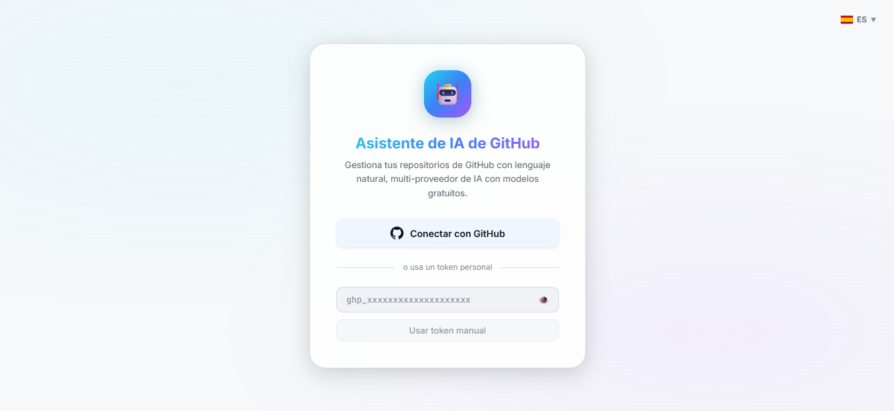
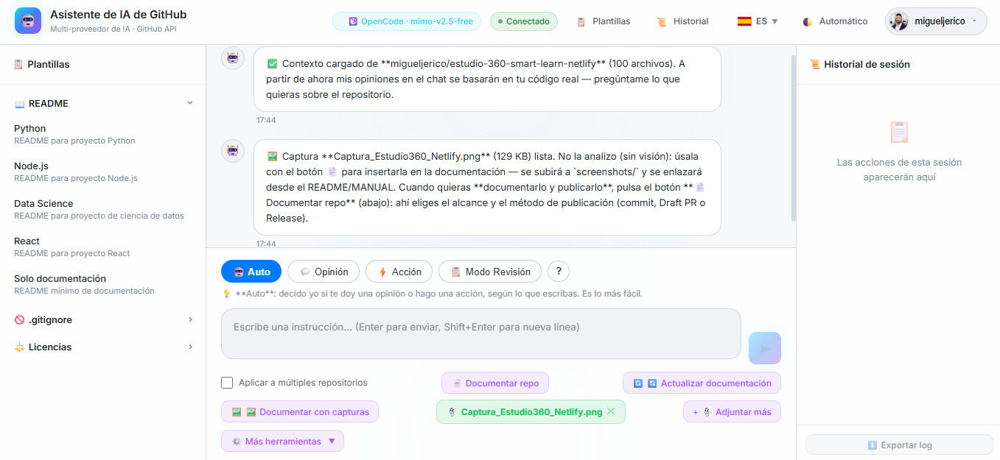
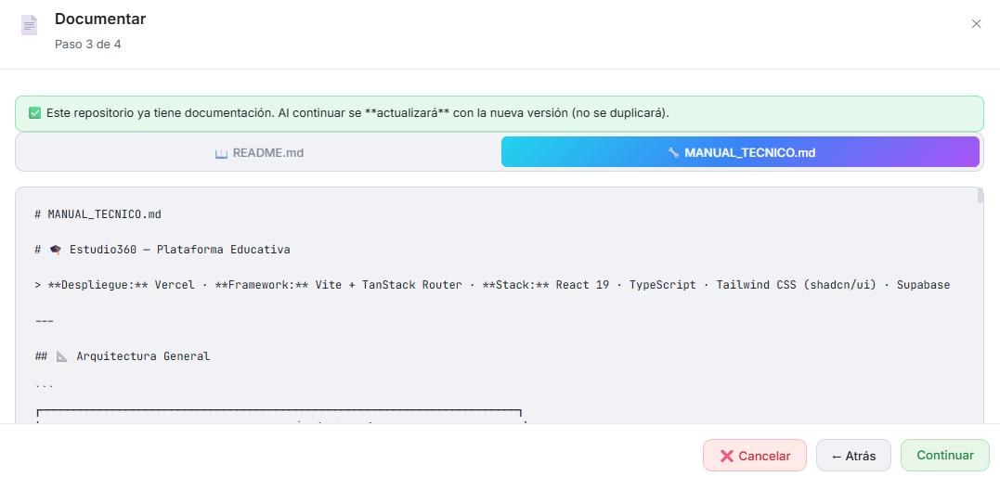

# 🤖 GitHub AI Assistant

<p align="center">
  
  <a href="https://github.com/migueljerico/github-ai-assistant/releases"></a>
  <a href="./LICENSE"></a>
  <a href="./e2e"></a>
  <a href="https://github.com/migueljerico/github-ai-assistant/actions/workflows/ci.yml"></a>
  <a href="https://codecov.io/gh/migueljerico/github-ai-assistant"></a>
</p>

<p align="center">
  
  
  
  
  
  
</p>

<p align="center">
  
  
  
  
  
  
  
  
  
  
</p>


> **Asistente Zero-Storage para analizar, documentar y gestionar repositorios de GitHub mediante lenguaje natural.**
>
> Proyecto de portfolio del curso de **Análisis de Datos e Inteligencia Artificial (2026)**, construido en 2 meses por un profesional de negocio sin experiencia previa en programación — prácticamente 100% funcional.

---

## 🚀 App en producción

[](https://github-ai-assistant-748914382449.us-central1.run.app/)

Conecta tu cuenta de GitHub mediante OAuth, elige tu proveedor de IA preferido y empieza a trabajar con tus repositorios en lenguaje natural.

> Tu token de GitHub y tus claves de IA viven únicamente en memoria durante la sesión.  
> No se almacenan en `localStorage`, `sessionStorage`, cookies, IndexedDB ni en ningún servidor.

---

## 📸 Vista Previa del Asistente





---

## 🎯 Qué hace

**GitHub AI Assistant** permite operar sobre GitHub como si estuvieras hablando con una persona.

En lugar de conocer endpoints, payloads, comandos Git o detalles de la GitHub REST API, escribes lo que quieres hacer en lenguaje natural y la aplicación:

1. Interpreta la intención mediante IA.
2. Propone una acción.
3. Muestra el plan al usuario.
4. Espera confirmación explícita.
5. Ejecuta la operación en GitHub.

Todo bajo el principio:

> **Propón → Confirma → Ejecuta**

---

## 📊 Métricas del proyecto

| Aspecto | Detalle |
|---|---|
| ⏱️ Tiempo de desarrollo | 2 meses de desarrollo continuo |
| ⚡ Latencia observada | ~400ms Groq / ~1.2s Gemini, variable según modelo y contexto |
| 🛡️ Seguridad | Zero-Storage: credenciales solo en memoria React |
| 🧪 Tests | 1.387 tests unitarios (1.319 cliente + 68 servidor) + 13 E2E (Playwright) |
| 🌐 i18n | 13 idiomas globales (ES, EN, ZH, HI, FR, AR, BN, PT, ID, UR, RU, DE, JA) con soporte RTL |
| 🌍 Deploy | Google Cloud Run |
| 📦 Stack | React + TypeScript + Express + Vite |

---

## ✨ Funcionalidades principales

| Área | Qué permite hacer |
|---|---|
| 💬 Lenguaje natural | Pedir acciones sobre GitHub sin conocer la API |
| 🌍 Internacionalización | 13 idiomas globales con banderas vectoriales SVG y dirección de texto RTL |
| ✅ Confirmación segura | Toda escritura requiere revisión y aprobación |
| 🗂️ Multi-repo | Aplicar acciones a varios repositorios |
| 🤖 Documentación automática | Generar README + MANUAL_TECNICO (completa o modo ligero para límites estrictos de tokens/TPM) |
| 📤 Publicación | Commit directo, Draft PR o GitHub Release |
| 📎 Archivos locales | Analizar PDF, DOCX, Excel/CSV, Power BI y texto/código |
| 📝 Issues/PRs | Resumir hilos con TL;DR, decisiones y pendientes |
| 📋 Changelog | Generar changelog desde commits recientes o desde el último release |
| 📊 Salud del código | Dashboard con lenguajes, commits y deuda técnica |
| 🛡️ Auditoría de seguridad | Revisión orientativa (LLM) de secrets, dependencias y validación de inputs |


Más detalle en ./docs/FUNCIONALIDADES.md.

## 📚 Documentación adicional

| Documento | Qué cubre |
|---|---|
| [`docs/ARQUITECTURA.md`](./docs/ARQUITECTURA.md) | Diagrama de arquitectura, flujos y principios de diseño |
| [`docs/FUNCIONALIDADES.md`](./docs/FUNCIONALIDADES.md) | Catálogo completo de funcionalidades |
| [`docs/INSTALACION.md`](./docs/INSTALACION.md) | Guía de instalación local, proveedores y variables de entorno |
| [`docs/SEGURIDAD.md`](./docs/SEGURIDAD.md) | Arquitectura Zero-Storage, OAuth, retries y mitigaciones |
| [`docs/TESTING_CALIDAD.md`](./docs/TESTING_CALIDAD.md) | Estrategia de testing, cobertura y CI/CD |
| [`docs/DESARROLLO_IA.md`](./docs/DESARROLLO_IA.md) | Flujo humano↔IA, dogfooding y lecciones aprendidas |
| [`docs/COMPARATIVA_COPILOT.md`](./docs/COMPARATIVA_COPILOT.md) | Diferencias frente a GitHub Copilot |
| [`MANUAL_TECNICO.md`](./MANUAL_TECNICO.md) | Referencia técnica manual (estructura, flujos, servidor) |
| [`CHANGELOG.md`](./CHANGELOG.md) | Historial de versiones |
| [`MEJORAS_FUTURAS.md`](./MEJORAS_FUTURAS.md) | Roadmap y mejoras pendientes |
| [`LICENSE`](./LICENSE) | Licencia MIT |

---

## 🆚 Diferencia frente a GitHub Copilot

GitHub Copilot es excelente como copiloto de código dentro del editor.

GitHub AI Assistant cubre otro terreno:

> **Operar, analizar, documentar y publicar proyectos de GitHub mediante lenguaje natural.**

La ventaja diferencial no es “hacer lo mismo gratis”, sino ser un asistente abierto, autoalojable, multi-proveedor y orientado a operaciones de GitHub con confirmación previa.

Ver comparativa completa en ./docs/COMPARATIVA_COPILOT.md.

---

## 🏗️ Arquitectura resumida

```text
Usuario
  ↓ lenguaje natural

Frontend React + TypeScript + Vite
  ├── GitHub API directa
  ├── Proveedores directos (con CORS): Groq · OpenRouter · Zenmux
  └── Proveedores vía proxy Express (sin CORS upstream):


Backend Express thin
  ├── OAuth GitHub
  ├── Proxies a proveedores sin CORS (/api/*)
  ├── Rate limiting (por proveedor)
  └── Health check
```


Ver arquitectura completa en ./docs/ARQUITECTURA.md.

---

## 🧱 Estructura del proyecto

```text
github-ai-assistant/
├── client/
│   ├── src/
│   │   ├── components/        # Componentes React de UI
│   │   ├── context/           # Contextos globales: auth, IA, historial, idioma
│   │   ├── hooks/             # Hooks reutilizables
│   │   ├── prompts/           # System prompts en Markdown
│   │   ├── services/          # GitHub API, IA, acciones, publicación
│   │   ├── types/             # Tipos TypeScript compartidos
│   │   ├── utils/             # Utilidades puras y testeables
│   │   ├── App.tsx            # Orquestación principal de la interfaz
│   │   └── main.tsx           # Entrada del frontend
│   ├── package.json
│   └── vite.config.ts
│
├── server/
│   └── index.js               # Backend Express: OAuth, proxies /api/* a proveedores sin CORS, health check
│
├── docs/
│   ├── FUNCIONALIDADES.md
│   ├── COMPARATIVA_COPILOT.md
│   ├── INSTALACION.md
│   ├── ARQUITECTURA.md
│   ├── SEGURIDAD.md
│   ├── TESTING_CALIDAD.md
│   └── DESARROLLO_IA.md
│
├── CHANGELOG.md               # Historial versionado del proyecto
├── MANUAL_TECNICO.md          # Documentación técnica extendida
├── MEJORAS_FUTURAS.md         # Roadmap y sprints pendientes
├── METODOLOGIA_IA.md          # Metodología humano ↔ IA
├── CLAUDE.md                  # Memoria operativa para agentes IA
├── Dockerfile                 # Build multi-stage para Cloud Run
├── package.json               # Scripts raíz y servidor
├── package-lock.json
├── .env.example
└── README.md
```

---

## 🔒 Seguridad

El proyecto sigue una arquitectura **Zero-Storage**:

- El token de GitHub vive solo en memoria React.
- Las claves de IA viven solo en memoria React.
- No hay persistencia automática de credenciales.
- Las acciones de escritura se confirman antes de ejecutar.
- OAuth usa `state` anti-CSRF generado con CSPRNG.

- Los endpoints propuestos por IA se validan antes de ejecutar.

### 🤖 Automatización continua

| Herramienta | Qué hace | Estado |
|-------------|----------|--------|
| **Dependabot** | PRs automáticos de actualizaciones npm + alertas GHSA/CVE | ✅ Activo |
| **CodeQL** | Análisis estático JS/TS, workflows, Docker en cada push/PR | ✅ Activo |

Ver detalle en ./docs/SEGURIDAD.md.

---

## 🧪 Testing y calidad

El proyecto usa **Vitest**, **React Testing Library**, **Playwright**, **GitHub Actions** y **Codecov**.

- **1.387 tests unitarios (1.319 cliente + 68 servidor)** + **13 tests E2E** con Playwright (5 specs)
- Tests unitarios, integración y componentes
- Tests del servidor
- Tests E2E del flujo crítico en navegador real (auth → chat → acción confirmada), del toggle de tema, de i18n, de persistencia y de accesibilidad (foco visible `:focus-visible` + `prefers-reduced-motion`, WCAG 2.4.7/2.3.3)
- CI con lint + tests + cobertura
- CD hacia Cloud Run

Ver detalle en ./docs/TESTING_CALIDAD.md.

---

## 🛠️ Stack tecnológico

| Tecnología | Uso |
|---|---|
| React 19 + TypeScript | Interfaz, estado y componentes |
| Vite | Bundler y entorno de desarrollo |
| Express.js | OAuth, proxies a proveedores sin CORS (/api/*) y servidor de producción |
| GitHub REST API v3 | Operaciones sobre repositorios |
| Groq Cloud | Inferencia rápida (directo del navegador) |
| Google Gemini | Modelo de IA vía proxy (bloqueo EU) |
| OpenRouter | Pasarela a múltiples modelos (directo del navegador) |
| NVIDIA NIM | Modelos optimizados vía proxy (sin CORS upstream) |
| Zenmux | Pasarela con modelos gratuitos (directo del navegador) |
| OpenCode Zen | Modelos gratis vía proxy (sin CORS upstream) |
| Cloudflare Workers AI | Modelos serverless vía proxy (chat + catálogo dinámico, sin CORS upstream) |
| Ollama Cloud | OpenAI-compatible vía proxy (sin CORS upstream) |
| Kilo | Pasarela OpenAI-compatible con catálogo público y modelos free vía proxy (sin CORS upstream) |
| BazaarLink | Pasarela OpenAI-compatible con catálogo público y modelos DeepSeek/Qwen vía proxy (sin CORS upstream) |
| Recharts | Dashboard de salud del código |
| Vitest | Testing (unitarios, integración) |
| Playwright | Testing E2E (flujo crítico) |
| Codecov | Cobertura |
| Docker | Build de producción |
| Google Cloud Run | Despliegue serverless |

---

## ⚙️ Instalación local

Ver guía completa en ./docs/INSTALACION.md.

Resumen rápido:

```bash
npm install
cd client && npm install && cd ..
cp .env.example .env
npm run dev
```

Abre:

```text
http://localhost:5173
```

---

## 🧠 Desarrollo asistido por IA

Este proyecto fue construido con un flujo **humano ↔ IA** basado en validación cruzada, revisión crítica y **dogfooding** (la propia app se usó para analizar el repositorio `github-ai-assistant`, revisar su arquitectura y proponer mejoras del roadmap).

> **Criterio rector:** ninguna salida de IA se tomó como verdad absoluta. Cada propuesta se revisó contra los principios del proyecto — Zero-Storage, confirmación previa, mantenibilidad, testing, coherencia arquitectónica, claridad para usuarios no técnicos y valor real como portfolio.

### 1 · Línea principal de desarrollo — entornos que escribieron código

Entornos agénticos que ejecutaron cambios directos en el repositorio (código, tests, docs y releases). Orden cronológico inverso.

| Entorno / Modelo base | Periodo | Aportación principal |
|---|---|---|
| **ZCode · Muse Spark 1.3** | v4.0.45 (2026-09-03) | **v4.0.45:** fix del proveedor OpenCode Zen para las familias muse-spark/gpt/grok, que solo aceptan la Responses API (`/responses`) y devolvían 500 "Internal server error" en `/chat/completions` (caso real: Muse Spark 1.2 y 1.3 desde ZCode). Enrutado por prefijo (`isResponsesModel`) al nuevo proxy `POST /api/openzen/responses`, transporte `callResponsesCompatible` con streaming de deltas y validación de key por la ruta real. Fallback verificado contra el catálogo en vivo (9 modelos free). Suite: 1.387 tests en verde (1.319 cliente + 68 servidor), lint y build limpias. |
| **ZCode · Qwen 3.8 Max 0902** | v4.0.44 (2026-09-03) | **v4.0.44:** diagnóstico y fix del doble techo de 300s (default del cliente en `generateRepoDocs` + request timeout de Cloud Run) que impedía documentar repos muy grandes con modelos de razonamiento (caso real: `estudio-360-smart-learn-netlify` vía QwenCloud) — default del modo completo a 600s alineado con el tope del proxy y de ⚙️, `deploy.sh` con `--timeout 600`, hoja de ruta #77 (streaming con timeout por inactividad) y +3 tests. Suite: 1.363 tests en verde (1.303 cliente + 60 servidor), lint y build limpias. |
| **Antigravity 2.0 · Gemini 3.8 Flash** | v4.0.41 → v4.0.43 (2026-09-03) | **v4.0.43:** fallback automático y resiliente ante error 503 (sobrecarga del modelo/proveedor) en generación de documentación con Gemini hacia `gemini-2.5-flash`, exposición de `setModel` en `AIProviderContext`, indicador de modelo activo, botón de cambio directo y selector de modelo en banner de sobrecarga en `DocumentFlowModal`, y reseteo incondicional de error al reintentar. **v4.0.42:** corrección de CORS en llamadas directas a proveedores externos (`X-Timeout-Ms` condicionado a proxy interno vía `isProxyEndpoint`), incorporación de Gemini 3.8 Flash al catálogo de modelos con i18n en 13 idiomas, y layout PWA standalone móvil con áreas seguras. Suite: 1.360 tests en verde (1.300 cliente + 60 servidor), lint y build limpias. |
| **ZCode · GLM-5.3-Flash** (`builtin:zai-start-plan`) | v4.0.40 → v4.0.41 (2026-09-02) | **v4.0.41:** diagnóstico y fix del "signal timed out" / 503 al documentar repositorios grandes — timeout adaptativo en `generateRepoDocs` (300s completo / 120s ligero vía `X-Timeout-Ms`), interceptación pedagógica de timeouts y sobrecarga en chat y modal, botón directo ⚡ Doc. ligera y fix CodeQL #9 (`isGroqEndpoint` por hostname). **v4.0.40:** límites de TPM en documentación con Modo de Documentación Ligera interactivo y banner pedagógico. Suite: 1.345 tests en verde (1.285 cliente + 60 servidor), 100% diff patch en Codecov. |
| **Antigravity 2.0 · Gemini 3.7 Flash** | v4.0.33 → v4.0.39 (2026-08-14 → 2026-09-02) | Entorno agéntico principal del ciclo. Incorporó `gemini-3.7-flash` al catálogo con i18n en 13 idiomas, optimizó timeouts/reintentos y sostuvo la expansión de cobertura. **v4.0.39:** corrección de selección automática en Groq (priorización de `openai/gpt-oss-20b` sobre `qwen3.8-27b`), manejo de error de modelos bloqueados por límites de proyecto en consola Groq (`model_permission_blocked_project`) y etiquetas amigables. **v4.0.37:** fix de sanitización multi-carácter (CWE-116) con `stripHtmlTags` iterativo en `gemini.ts`. **v4.0.36:** 100% funciones y líneas en `DocumentFlowModal.tsx` y 98,16% líneas en `assistantActions.ts`. **v4.0.35:** `extractRepoSummary` para el "about" de GitHub (límite 350 caracteres). Suite final del ciclo: 1.324 tests unitarios en verde, 100% patch Codecov. |
| **ZCode · GLM-5.3** (`builtin:zai-start-plan`) | v4.0.34 (2026-08-16) | Expansión Codecov **+30 tests**: `gemini.ts` al 100% de líneas (`buildSecurityAuditContext`, `validateProviderKey`, errores HTTP, streaming vacío, JSON truncado), `priorityScore` y refetch 404 en `github.ts`, dedup de catálogos y detección free en `providers.ts`, y `extraFiles`/`uploadFilesToRepo` en `docPublisher.ts`. Cobertura global 95,22→96,26% statements. |
| **Antigravity 2.0 · Gemini 3.6 Flash** | v3.68.0 → v4.0.32 (2026-08) | Desarrollo agéntico previo: integración de proveedores **Kilo** y **BazaarLink**, manejo de error 429 y reintentos transitorios, y mantenimiento de releases. |
| **ZCode · GLM-5.2** (`step-3.7-flash-free` / `builtin:zai-coding-plan`) | desde v3.25.0 (2026-07) | Cierre sistemático de versiones — bump, `CHANGELOG.md`, sincronización documental y release. Destacan **v3.27.0 (#57)** con Tencent HY3 (ver §2), **v3.28.0 (#50 y #51)**: presupuesto de contexto adaptativo por proveedor (Groq free 6/60 vs 12/80), reintento por TPM y bloque "Archivos consultados", y **v3.30–v3.31**: fix del truncado de 4096 tokens en documentación. |
| **GLM-5.2 (web, Zhipu)** | v3.20.0 | i18n Fase 1 y tareas puntuales previas. |
| **Antigravity 2.0** (base) | Fase inicial | Construcción inicial agéntica de la versión full-stack (React + Express + OAuth). |
| **Claude / Claude Code** (Anthropic) | Fase de arquitectura | Diseño de arquitectura, revisión crítica y documentación fundacional. |

### 2 · Contribuciones puntuales cerradas como issue

Trabajos que nacieron como propuesta y se cerraron con PR y versión etiquetada.

| Modelo / Vía | Issue | Qué resolvió |
|---|---|---|
| **Tencent HY3** (OpenRouter, `tencent/hy3:free`) | **#57 — v3.27.0** | Unificó la UI de documentación en un único **stepper de 4 pasos** (alcance → generar → revisar → destino+método), fusionando "Documentar repo" y "Documentar y publicar" y eliminando `DocModal`/`FilePublishModal`. Previamente (dogfooding 06/07) propuso la poda de **#33** (revisores) y **#35** (auto-labels). |
| **GLM-5.2** (`builtin:zai-coding-plan`) | **#50 y #51 — v3.28.0** | Presupuesto de contexto adaptativo por proveedor, reintento con menos contexto ante error de TPM/context-length, fix del mensaje duplicado y bloque plegable "Archivos consultados para esta respuesta" (`contextRanker`). |

### 3 · Validación cruzada, revisión y dogfooding

Modelos usados para contrastar arquitectura, revisar roadmap o probar la app con el repo cargado como contexto. Propusieron mejoras; el autor decidió qué incorporar.

| Modelo / Vía | Rol | Aportación |
|---|---|---|
| **Microsoft 365 Copilot — GPT-5 Razonamiento** | Revisión editorial | Reorganización del README y propuesta de modularización en `docs/` (`FUNCIONALIDADES.md`, `ARQUITECTURA.md`, etc.). |
| **Nemotron 3 Super 120B** (NVIDIA, vía OpenRouter) | Validación cruzada | Sugirió incluir el deploy automático de Cloud Run en la rutina de cierre (`commit → push → tag → release → deploy`) y corregir `CLAUDE.md`. |
| **QwenCloud · Qwen 3.8 Max** (Alibaba Cloud) | Dogfooding 2026-08-06 | Con 218 archivos cargados propuso **#76 `ChatToolsMenu`** — revelado progresivo de herramientas avanzadas (9 botones → menú "Más herramientas"). Incorporada al roadmap. |
| **ling-3.0-flash:free** (Zhipu, vía Kilo) | Dogfooding 2026-07-28 y fix v3.67.0 | **#75 (tests E2E)** — única propuesta concreta y verificable del roadmap; descartó genéricas ya cubiertas. **v3.67.0:** diagnosticó el bug "Documentar → Documento específico" que ignoraba la instrucción del chat; fix en `generateSpecificDoc` (precedencia de instrucción de usuario + `conversationHistory` desde `App.tsx`). |
| **Gemini, Gemma, DeepSeek, Qwen y otros** | Contraste técnico | Revisión de arquitectura, propuestas de mejora y contraste de decisiones. |

### Dogfooding y separación documental

El dogfooding siguió el flujo: cargar el repo como contexto → pedir revisión crítica con distintos proveedores → comparar respuestas → filtrar elogios genéricos → reformular lo accionable según los principios del proyecto → añadir al roadmap o implementar.

La reorganización documental separa el README —breve y orientado a impacto— de la documentación extendida:

```text
docs/
├── FUNCIONALIDADES.md
├── COMPARATIVA_COPILOT.md
├── INSTALACION.md
├── ARQUITECTURA.md
├── SEGURIDAD.md
├── TESTING_CALIDAD.md
└── DESARROLLO_IA.md
```

Ver proceso completo en [`docs/DESARROLLO_IA.md`](./docs/DESARROLLO_IA.md) y [`METODOLOGIA_IA.md`](./METODOLOGIA_IA.md).

> ℹ️ **Reorganización de esta sección realizada por Muse Spark 1.2 Contributor (2026-08-27):** la información ya existía pero estaba dispersa en una lista cronológica plana; se ha reagrupado por rol (línea principal de desarrollo, contribuciones cerradas y validación/dogfooding), ordenada cronológicamente dentro de cada grupo y tabulada para facilitar la lectura como portfolio. El contenido factual no se ha alterado.


---

## 📚 Contexto formativo

Este proyecto forma parte del programa de formación en **Análisis de Datos e Inteligencia Artificial (INAEM, 2026)**.

El objetivo fue explorar cómo una persona sin experiencia previa en programación puede construir una aplicación full-stack real utilizando IA como acelerador, manteniendo criterios de arquitectura, seguridad, testing, documentación y despliegue.

> *“No soy ingeniero de software. Soy un profesional de negocio que ha aprendido a construir productos de IA pensando como un ingeniero.”*

---

## ⚠️ Limitaciones conocidas

| Área | Detalle | Mitigación / Estado |
|------|---------|---------------------|
| **Vulnerabilidades `xlsx` (SheetJS)** | `xlsx@^0.18.5` tiene Prototype Pollution (GHSA-xvch-5gv4-9q4h) y ReDoS (GHSA-93q8-gq69-qvxp) sin fix en npm (paquete descontinuado). Riesgo solo al leer archivos Excel/CSV maliciosos. | **v3.36.1 mitigado:** límite 10 MB, validación post-parseo, aviso UI, rate limit, CI permissions. **NO migrar a `exceljs`** (+4 MB bundle). Ver `docs/SEGURIDAD.md`. |
| **Visión / imágenes** | No hay análisis de imágenes (multimodal requeriría backend y modelos específicos). | Descartado por arquitectura. |
| **Power BI `.pbix` moderno** | El código M (Power Query) va en modelo binario VertiPaq (no legible). | Exportar a `.pbit` para extraer M. |
| **Word `.doc` binario** | Solo `.docx` (OOXML/ZIP) soportado. | Convertir a `.docx`. |

---

## 🔮 Roadmap

Ver ./MEJORAS_FUTURAS.md.

---

<p align="center">
Desarrollado por <a href="https://github.com/migueljerico">@migueljerico</a> con asistencia de IA, validación cruzada y revisión crítica · 2026
</p>
